# Elastiflow Guide
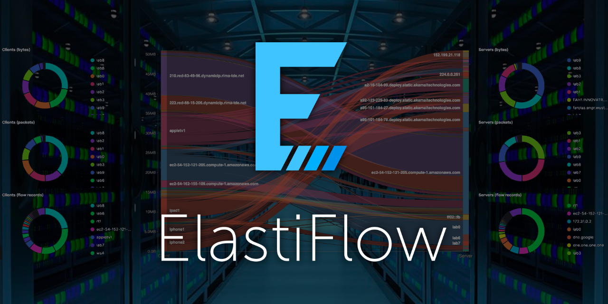

- [Elastiflow Guide](#elastiflow-guide)
  - [Sample Screenshots](#sample-screenshots)
  - [TLDR Installation](#tldr-installation)
  - [Installation](#installation)
    - [Clone respository](#clone-respository)
    - [Verify Docker is running](#verify-docker-is-running)
    - [Deploy Elastiflow containers](#deploy-elastiflow-containers)
    - [Confirm Elastiflow deployment](#confirm-elastiflow-deployment)
  - [Elastiflow Web GUI](#elastiflow-web-gui)
    - [Download Elastiflow Kibana objects](#download-elastiflow-kibana-objects)
    - [Install Elastiflow dashboards](#install-elastiflow-dashboards)
    - [View Elastiflow dashboards](#view-elastiflow-dashboards)
  - [Add Netflow data to Elastiflow](#add-netflow-data-to-elastiflow)
    - [Import Netflow data from a file](#import-netflow-data-from-a-file)
    - [How to collect Netflow data](#how-to-collect-netflow-data)
    - [Verify Netflow collector port is open](#verify-netflow-collector-port-is-open)
  - [Troubleshooting](#troubleshooting)
    - [Verify Netflow collector port is open](#verify-netflow-collector-port-is-open-1)
    - [Verify incoming flow data from an exporter](#verify-incoming-flow-data-from-an-exporter)
  - [Netflow exporter](#netflow-exporter)

## Sample Screenshots
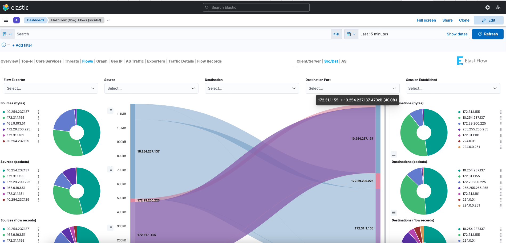
<br />
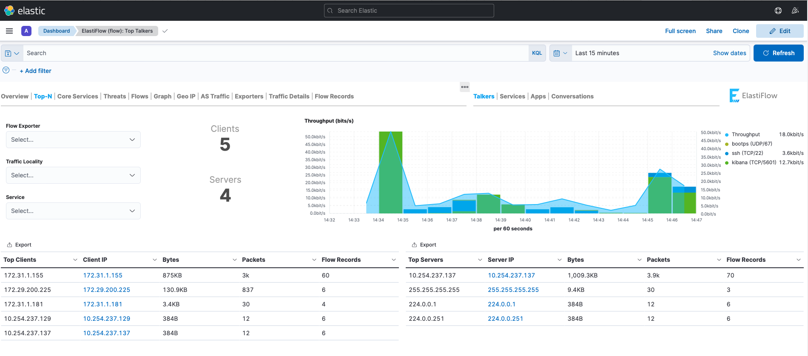
<br />
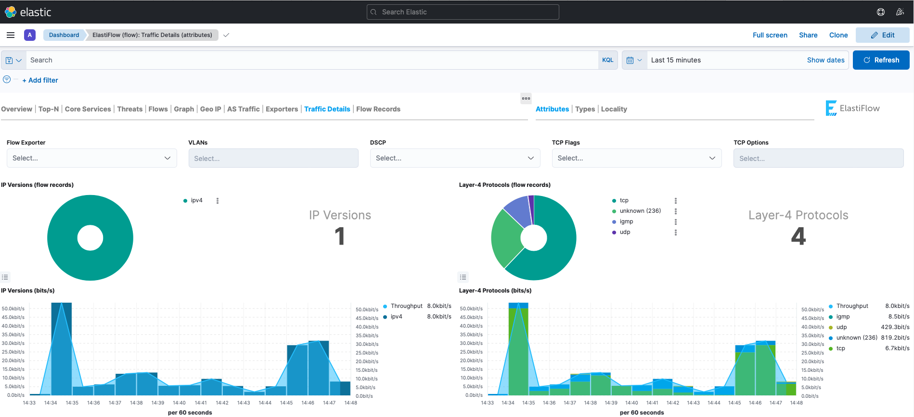
<br /><br />

## TLDR Installation


* `git clone https://github.com/joshbhorton/elastiflow.git` - Clone the install repo

* `cd elastiflow` - Navigate to the local repo

* Deploy Elastiflow containers
    * Linux - `docker-compose -f docker-compose-linux.yml up -d`
    * Mac `docker-compose -f docker-compose-mac.yml up -d`

* `docker ps` - Verify containers are running (elasticsearch, kibana and flow-collector)

* Download Elastiflow Kibana objects:
    *  `https://github.com/elastiflow/elastiflow_for_elasticsearch/blob/master/kibana/flow/kibana-7.17.x-flow-codex.ndjson`
    * `https://github.com/elastiflow/elastiflow_for_elasticsearch/blob/master/kibana/flow/kibana-7.17.x-flow-ecs.ndjson`
    <br />

* Navigate to `http://<server_ip>:5601` with a web browser to access Kibana.

* Install Elastiflow dashboards:
    * Navigate to `http://<server_ip>:5601/app/management/kibana/objects`
    * Import the Elastiflow objects files previously downloaded.

* View Elastiflow dashboards:
    * Navigate to `http://<server_ip>:5601/app/dashboards`
    * Explore dashboards
<br /><br />
## Installation
### Clone respository

Clone this repository to a local directory and navigate to the 'elastiflow' directory.

```
git clone https://github.com/joshbhorton/elastiflow.git
cd elastiflow
```
<details>
<summary markdown="span">Sample Output</summary>

    bash Documents# git clone https://github.com/joshbhorton/elastiflow.git
    Cloning into 'elastiflow'...
    remote: Enumerating objects: 4, done.
    remote: Counting objects: 100% (4/4), done.
    remote: Compressing objects: 100% (3/3), done.
    remote: Total 4 (delta 0), reused 0 (delta 0), pack-reused 0
    Receiving objects: 100% (4/4), done.
    bash Documents# ls -l
    total 0
    drwxr-xr-x  5 hortonjo  staff  160 May 11 11:34 elastiflow
    bash Documents# cd elastiflow
    bash elastiflow#

</details>
<br />

### Verify Docker is running

Verify Docker is installed and running

```
docker ps
```

<details>
<summary markdown="span">Sample Output</summary>

    hortonjo@C02FM7EHMD6M elastiflow % docker ps
    CONTAINER ID   IMAGE     COMMAND   CREATED   STATUS    PORTS     NAMES

</details>
<br />

### Deploy Elastiflow containers
Use the `docker-compose` command to deploy Elastiflow containers using docker-compose

```
docker-compose -f docker-compose-mac.yml up -d
or
docker-compose -f docker-compose-linux.yml up -d
```
<details>
<summary markdown="span">Sample Output</summary>

```
bash elastiflow # docker-compose -f docker-compose-mac.yml  up -d
Pulling elastiflow-elasticsearch (docker.elastic.co/elasticsearch/elasticsearch:7.17.1)...
7.17.1: Pulling from elasticsearch/elasticsearch
4fb807caa40a: Pull complete
8c8aa6b1aa86: Pull complete
001e38ce980d: Pull complete
f154017b6c80: Pull complete
12fa46d826fc: Pull complete
7b7a5e426298: Pull complete
aa1c4e986642: Pull complete
14321b269eb8: Pull complete
cd4615d43eeb: Pull complete
Digest: sha256:35f81ab02dda48d6f81ad9be52b25cdbd3a832e8660b48218af805d6de3ddba8
Status: Downloaded newer image for docker.elastic.co/elasticsearch/elasticsearch:7.17.1
Pulling flow-collector (elastiflow/flow-collector:6.2.2)...
6.2.2: Pulling from elastiflow/flow-collector
06d39c85623a: Pull complete
661d7a73d8dc: Pull complete
16df59fb7f78: Pull complete
708e8a002103: Pull complete
Digest: sha256:2205c87d788e405039222be7f0281dd59920e3f7826bff0904fc099a0d7415f8
Status: Downloaded newer image for elastiflow/flow-collector:6.2.2
Pulling elastiflow-kibana (docker.elastic.co/kibana/kibana:7.17.1)...
7.17.1: Pulling from kibana/kibana
4fb807caa40a: Already exists
9ccdbeaba3d4: Pull complete
ae7921af80a9: Pull complete
d3c67bfb8a11: Pull complete
e51b148f320a: Pull complete
5d7bfa93410a: Pull complete
c51b6dca9cb1: Pull complete
8f91cb43849f: Pull complete
d357960590cf: Pull complete
a95a95a8d9f4: Pull complete
0b8f2053e729: Pull complete
4ec440012c31: Pull complete
96883fe607e2: Pull complete
Digest: sha256:e158b9f7d31f78ca3f36627ec9a0b38658093f6bbabd6c5416935361c7a8a710
Status: Downloaded newer image for docker.elastic.co/kibana/kibana:7.17.1

Creating elastiflow-elasticsearch ... done
Creating elastiflow-kibana        ... done
Creating flow-collector    ... done
```
</details>
<br />

### Confirm Elastiflow deployment
Use the `docker` command to verify the containers are running:
```docker
docker ps
```
The following containers should be running:
* elastiflow-elasticsearch - Standard Elasticsearch Container maintained by Elastic
* elastiflow-kibana - Standard Kibana Container maintained by Elastic
* flow-collector - Netflow collector maintained by Elastiflow. Receives netflow, sflow data stores data in Elasticsearch, Kafka, etc


<details>
<summary markdown="span">Sample Output</summary>

```docker
bash elastiflow # docker ps
CONTAINER ID   IMAGE                                                  COMMAND                  CREATED         STATUS         PORTS     NAMES
e39aefd52aa4   docker.elastic.co/kibana/kibana:7.17.1                 "/bin/tini -- /usr/l…"   6 seconds ago   Up 3 seconds             elastiflow-kibana
110ffa35ea50   elastiflow/flow-collector:6.2.2                        "/usr/local/bin/flow…"   8 seconds ago   Up 5 seconds             flow-collector
4ed31f7ea841   docker.elastic.co/elasticsearch/elasticsearch:7.17.1   "/bin/tini -- /usr/l…"   8 seconds ago   Up 5 seconds             elastiflow-elasticsearch
```
</details>
<br />

## Elastiflow Web GUI
Navigate to the Kibana front-end using a web browser. For simplicity and development purposes, security is not automatically enabled for this deployment.

    http://<server_ip>:5601

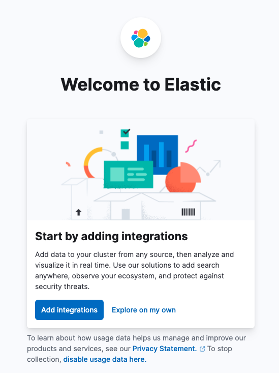

<br />

### Download Elastiflow Kibana objects
Download one of the .ndjson files to a local directory on your PC
* [kibana-7.17.x-flow-codex.ndjson](https://github.com/elastiflow/elastiflow_for_elasticsearch/blob/master/kibana/flow/kibana-7.17.x-flow-codex.ndjson)
* [kibana-7.17.x-flow-ecs.ndjson](https://github.com/elastiflow/elastiflow_for_elasticsearch/blob/master/kibana/flow/kibana-7.17.x-flow-ecs.ndjson)
<br />

### Install Elastiflow dashboards
Import the .ndjson file downloaded from Github using the Kibana Web GUI.
* Navigate to [Stack Management > Saved Objects](http://127.0.0.1:5601/app/management/kibana/objects')
* Click the 'Import' button
    <details>
    <summary markdown="span">Screenshot</summary>
    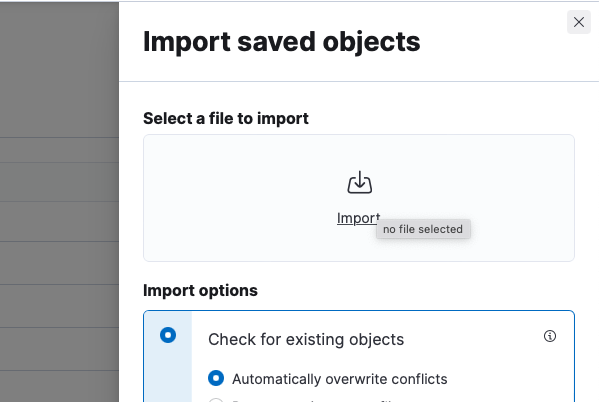
    </details>
* Select the file to be imported.
    * kibana-7.17.x-flow-ecs.ndjson
    * kibana-7.17.x-flow-codex.ndjson
    <details>
    <summary markdown="span">Screenshot</summary>
    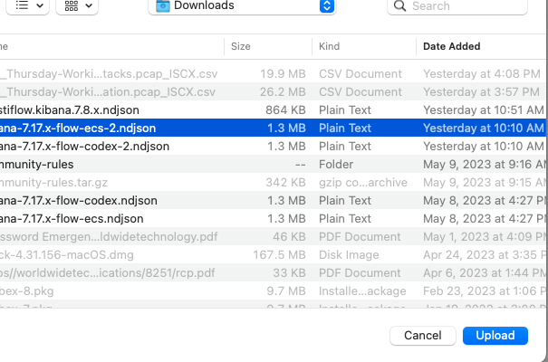
    </details>

* Verify objects were imported

    <details>
    <summary markdown="span">Screenshot</summary>
    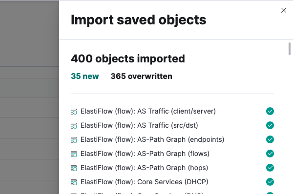
    </details>

### View Elastiflow dashboards
Navigate to

* Navigate to the [Kibana Dashboards](http://<server_ip>:5601/app/dashboards)
* Explore dashboards
    <details>
    <summary markdown="span">Screenshot</summary>
    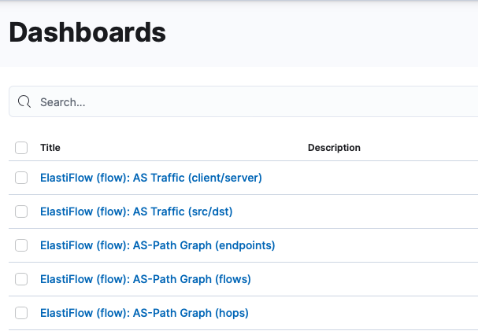
    </details>

## Add Netflow data to Elastiflow
Netflow data can be imported from a file or collected using the 'flow-collector' container.
<br />

### Import Netflow data from a file
* Navigate to [Integrations > Upload File](http://127.0.0.1:5601/app/home#/tutorial_directory/fileDataViz)
* Select or drag and drop a file on the page
    <details>
    <summary markdown="span">Screenshot</summary>
    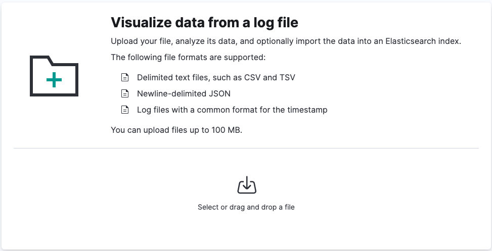
    <br /><br />
    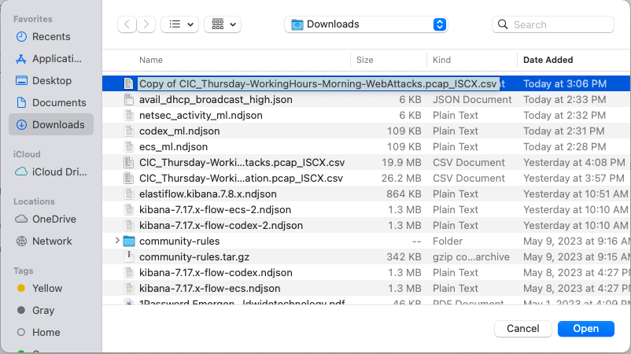
    </details>
    <br />
* Review the file summary and click 'Import' at the bottom of the page.
    <details>
    <summary markdown="span">Screenshot</summary>
    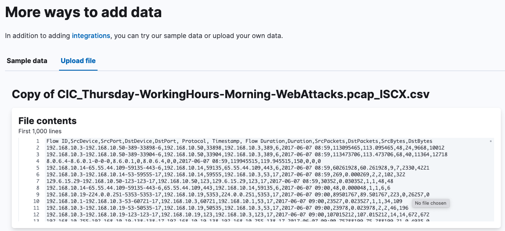
    <br />
    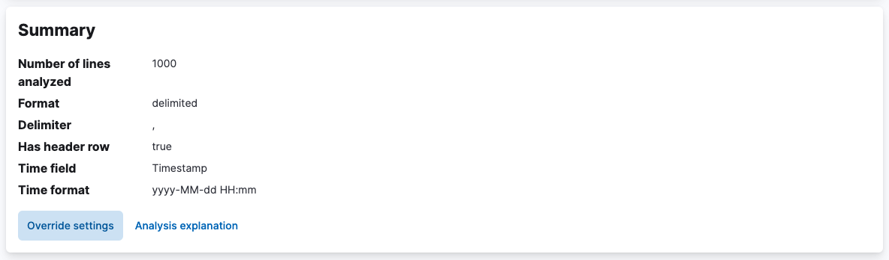
    <br />
    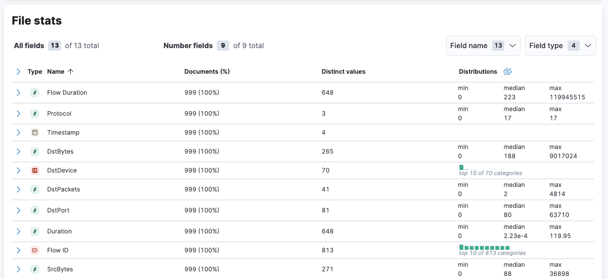
    <br />
    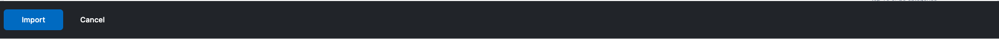
    </details>
    <br />

* Set an index name and click 'Import'
    <details>
    <summary markdown="span">Screenshot</summary>
    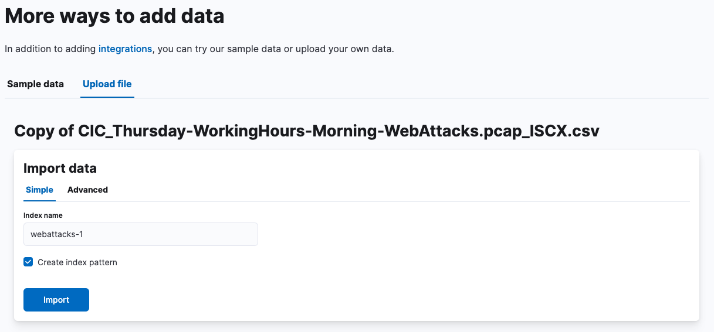
    </details>
    <br />

* Review the status of the import
    <details>
    <summary markdown="span">Screenshot</summary>
    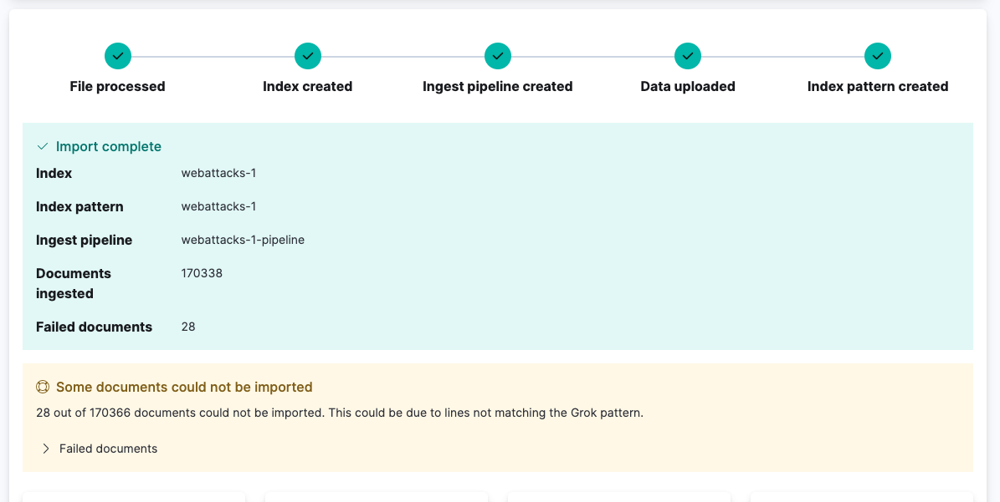
    </details>
    <br />


### How to collect Netflow data
<details>
<summary markdown="span">Sample Output</summary>
</details>
<br />

### Verify Netflow collector port is open
<details>
<summary markdown="span">Sample Output</summary>
</details>
<br />

## Troubleshooting
### Verify Netflow collector port is open
<details>
<summary markdown="span">Sample Output</summary>
</details>
<br />

### Verify incoming flow data from an exporter
<details>
<summary markdown="span">Sample Output</summary>
</details>
<br />


## Netflow exporter
